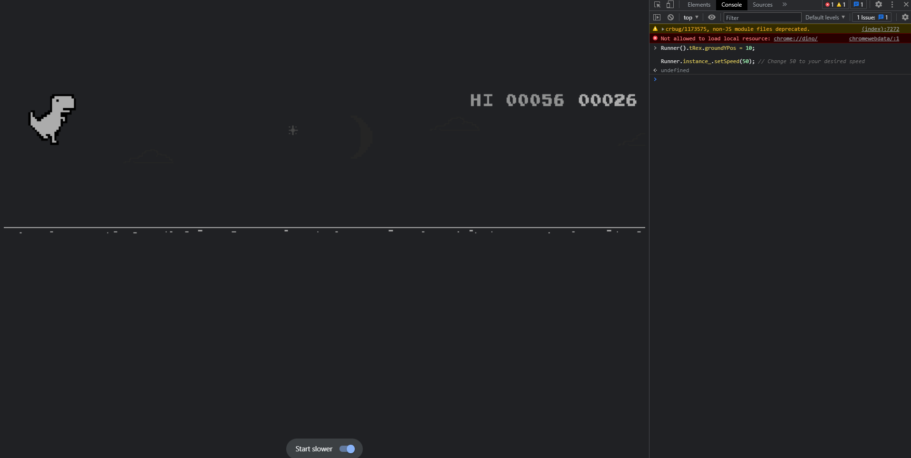

# Dino Game Scripts

# Installation

Go to the dino game. It can be accessed by going to: ```chrome://dino```. Next right click and select inspect element or click CTRL + Shift + I, and navigate to console.
Next, just paste the script in. 


# Fly 1

This is a simple script to have the dinosaur fly over all the cactuses. It's speed can be changed. 

[You can get the script here](fly/fly.js)

Here is what it looks like


